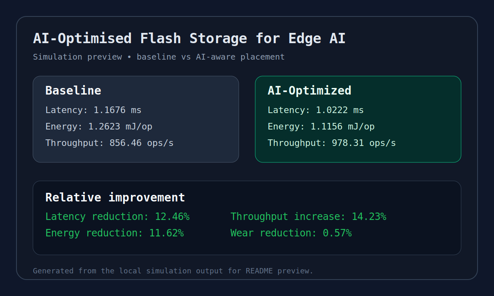

# AI-Optimised Flash Storage for Edge AI

A portfolio-ready Python simulation that demonstrates how AI-aware data placement can improve flash storage performance for edge devices.



## Demo options

- Terminal mode for quick verification
- Streamlit web app for presentation and live demo

## Why this project stands out

This project moves beyond a generic storage simulation by framing the problem around **edge AI workloads** such as video analytics, sensor fusion, and model caching. The simulation compares:

- **Baseline random placement**
- **AI-optimised energy-aware placement**

The goal is to show how intelligent workload-aware storage decisions can reduce latency, lower energy use, and improve throughput.

## Project idea upgrade

To make the project more impressive for lecturers, recruiters, or GitHub visitors, position it as a:

**Lightweight Edge-AI Storage Optimisation Simulator**

That tells a stronger story than just “flash architecture.” It shows:

- systems thinking
- AI-inspired decision logic
- performance engineering
- energy-efficiency awareness
- practical experimentation

## Current features

- Synthetic edge workload generation
- Zone-based flash model with different latency, energy, and wear profiles
- AI-inspired hotness scoring policy
- Capacity-aware block placement
- Placement-aware scheduling bonuses for matched data-zone behavior
- Baseline vs optimised comparison report
- Unit tests and GitHub Actions CI
- Clean single-file prototype for learning

## Verified sample results

Using the current default simulation setup:

- **Latency reduction:** 12.46%
- **Energy reduction:** 11.62%
- **Wear-cost reduction:** 0.57%
- **Throughput increase:** 14.23%

## Repository structure

- [edge_ai_flash_project.py](edge_ai_flash_project.py) — main simulation script
- [app.py](app.py) — Streamlit demo application
- [tests/test_edge_ai_flash_project.py](tests/test_edge_ai_flash_project.py) — unit tests
- [.github/workflows/python-ci.yml](.github/workflows/python-ci.yml) — GitHub Actions CI
- [.gitignore](.gitignore) — ignores Python cache and local environment files
- [LICENSE](LICENSE) — MIT license

## How to run

1. Install Python 3.10+
2. Open the project folder
3. Install dependencies
4. Run the main script

```bash
python edge_ai_flash_project.py
```

Expected result: a report comparing baseline and AI-optimised placement.

## How to run the web demo

```bash
streamlit run app.py
```

The browser demo lets you change workload size and seed, then compare baseline and AI-optimised metrics live during your presentation.

## How to test

```bash
python -m unittest discover -s tests -v
```

## Example project pitch

> Edge devices increasingly run AI workloads, but their flash storage is usually managed with generic strategies that ignore workload behavior. This project simulates an AI-optimised flash placement layer that analyses access frequency, write intensity, and data reuse to place blocks more efficiently. The result is lower latency, reduced energy consumption, and better throughput for next-generation edge systems.

## GitHub checklist

A strong beginner-friendly GitHub repo should include:

- clear project title
- problem statement
- setup steps
- test coverage
- license
- CI workflow
- future roadmap

This repository now includes the core pieces.

## Suggested future upgrades

If you want to push this further, add one or more of these:

1. **Charts**: export results and plot latency/energy comparisons
2. **Scenario presets**: healthcare edge AI, autonomous drones, smart city cameras
3. **CLI arguments**: choose workload size, random seed, or strategy
4. **Dashboard**: small Streamlit app for interactive demos
5. **Results export**: save JSON or CSV reports for analysis
6. **Real ML model**: replace heuristic scoring with a trained classifier/regressor

## License

This project is released under the MIT License. See [LICENSE](LICENSE).
